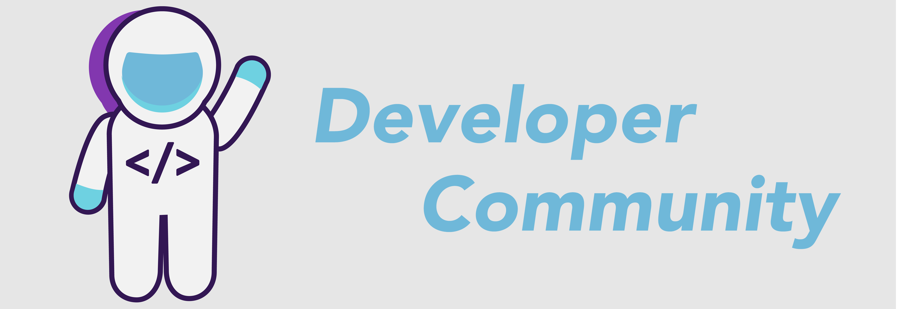

 

 
<h1>Developer Community</h1>
<strong>Developer Community - another hugely important part of the Developer Relations umbrella!</strong>

 

          

## Table of Contents

* [DeveloperCommunity](#developerCommunity)  
* [DeveloperCommunityCanvas](#developerCommunityCanvas)  
* [DeveloperCommunityPersonas](#developerCommunityPersonas)  
* [DeveloperCommunityPortals](#developerCommunityPortals)  
* [Notes](#notes)  

### DeveloperCommunity

In terms of developer community the core question is: **are they customers or partners?**

* Most communities are unnecessary to members
* Discussion build relationships and relationships build communities
* Developer Community management is about nurturing conversations
* You need to explicitly ask your community for its needs
* Main purpose of the community is to empower developers to share knowledge with each other
* Developer Community is about relying on others
* Developer Community isn't something that you can fully control

**Developer Community Lifecycle**

* Inception
* Establishment
* Maturity
* Mitosis
* Death

**OR**

* Awareness
* Education
* Retention
* Adoption

**Developer Communication**

Hugely important element of your developer community is communication.

* Treat all content as public content
* Treat all content as company content

The secret of marketing and communicating with developers is not to use marketing. There is no developer marketing, only teaching, inspiring and helping.

**Community Commitment Curve**

 Community Getting Started

* Identify target devs
* Say goodbye to inactive members on a regular basis
* Minimum commitment is expected from each member so set minimum expectations
* Identify their interests and motivations
* Remove barriers to adoption

**Framework for launching Developer Communities - C.A.R.G.O (from Vanilla Forums)**

* Concept
* Acquisition
* Retention
* Goals
* Outcome

**Offering a new space to connect is no longer compelling on its own -> Conducting member research is crucial**

**Onboarding and keeping developers is key**

* Make developers feel welcomed and comfortable
* Give specific, simple steps to get started
* Don't overwhelm with too much info/tasks
* Over time interact in multiple ways
* Convey the culture and voice

**Increasing Developer Participation**

* Recognition and status boost
* Access to more info, tools, resources
* More capabilities and control
* Swag, cool stuff

In order to increase developer participation do such audit at least twice a year:

* What are the challenges for your community audience?
* Who are your community personas?
* Who are the key people within your org?
* Why community should matter to them?

**A few strategy tips**

* Make sure questions are answered
* Proactive outreach to encourage additional engagement
    * Mark best answers
    * Reply to others' posts on related topics
* Encourage less intimidating engagement actions for those who haven't yet posted
* Users might be inactive but they are listening
* "We miss you emails"

### DeveloperCommunityCanvas

**Community Canvas** is a great framework to use to design a successful community. **More on this can be found in Assets folder**

### DeveloperCommunityPersonas

**One of the things that is invaluable in the community / developer relations space is to create a persona around who the audience is**

* **Consumers** in a community come with an expectation to be served: they attend events, at events they listen to speakers, in the online community they read or sometimes react to things, but usually only when it seems useful to them. If they don’t like something in the community, they complain or disengage. They feel that leading the community is someone else’s responsibility and they are mostly in the community for opportunistic reasons.

* **Co-creators** on the other hand actively shape events they go to or they help organize them. In discussions, both online and in person, they actively contribute new ideas and initiatives without expecting anything in return. If they don’t like something, they bring it up for discussion and provide new ideas and suggestions how to address it. If a conflict arises, they are willing to work through it. They invest their energy, time and money into the organization, because they feel that this community is partially also their own organization and therefore their responsibility to push it forward.

Those personas can have certain community feelings:

* **Influence** - I have influence over what this community is like
* **Fulfilment** - I get important needs of mine met because I am part of this community
* **Connection** - Members of this community have shared important events together
* **Boundaries** - It is very important for me to be in this community
* **Safety** - I can trust people in this community
* **Belonging** - Being a member of this community is part of my identity
* **Investment** - I put a lot of time and effort into this community

**Super Community Persona - Super User**

Super users are the people who perform great in your community. We don't want super users to do advocacy for free stuff.

* **Identity** – the mechanisms for how we are able to display, share and take pride in the accomplishment of becoming a super user
* **Privileges** – the set of technical capabilities, access to, and engagement with the company, and opportunities to have their leadership sanctioned
* **Tangibles** – the “goods,” whether physical items, account credits, or invitations to special events

There are no lifetime memberships. Each member has to be reconsidered on a set time frame, no matter how good their contributions may be. This allows you to roll in new blood and remove inactive members. It also allows members who have stopped participating due to life circumstances a chance to step back and save face.

**Community Member Journey**

The journey of community member maturity:

Aware -> Engaged -> Achieved

**Measurements**

* Number of members Aware
* Number of members Engaged
* Number of members moving from Aware to Engaged
* Number of members Achieved
* Number of members moving from Engaged to Achieved

### DeveloperCommunityPortals

**Developer Portals Elements**

When migrating a developer community to a new platform:

* **Phase 1** - get your team and top 1% active community members to populate with content
* **Phase 2** - invite all active members to participate in "beta" of new community
* **Phase 3** - invite everyone else

### Notes

* People will follow when you're being your authentic self
* Developers are not only in US and Europe
* Always stay bi-directional: care about your developers but also your internal team
* Before collecting data, build trust
* Developers want to hear from each other
* It takes time to get developers to love you. It requires trust building, living by their values, thinking and speaking like them. Do it for a long enough time so that they understand you are one of them
* Be as personal as possible, try not to communicate toward everyone
* Know your audience
* Changes in community behaviour takes time (months, years)
* Understand community members at personal level
* As a Community Manager your job is to build up the community, not yourself. You succeed if and only if the community succeeds
* Guiding a community is stressful work. You have to hold yourself to the highest of standards while everyone else gets to be human
* Deleting content is generally safer than editing it
* Make sure everything you send developers in mail, makes their life better
* If you don't know an answer to a question in your FAQ, just say that
* Successful communities explicitly define what the expectations are towards each member. If every member knows what is expected, they can contribute accordingly (or choose not to)
* It's better to overcommunicate
* Make your community indispensable to your organization
* Make the community indispensable to your members
* You shouldn’t forget your existing members. You need to ensure that they are still experiencing the value they were promised
* We should always be optimizing for developer joy
* Connect with your audience:
  * Get personal (empathy)
  * Stay on target
  * Be reachable
  * Pay huge attention to onboarding processes
